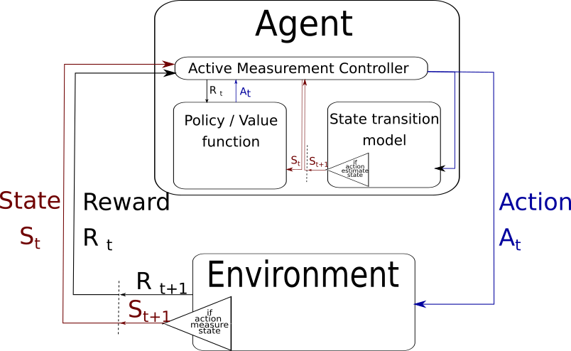

# Model Based Active Measure Reinforcement Learning
This repository includes the code associated with the paper 'Active Measure Reinforcement Learning for Observation Cost Minimization' presented at the Canadian Conference on Artificial Intelligence 2021. See the manuscript [here](https://caiac.pubpub.org/pub/3hn8s5v9/release/1).

# Citation

    @inproceedings{bellinger2021amrl,
    title={Active Measure Reinforcement Learning for Observation Cost Minimization},
    author={Bellinger, Colin and Rory, Coles and Crowley, Mark and Tamblyn, Isaac},
    booktitle={34th Canadian Conference on Artificial Intelligence},
    year={2021}
    }

## Background:

The action-perception cycle in RL generally assumes that a measurement of the state of the environment is available at each time step without a cost nor a delay. In applications such as materials design, deep-sea and planetary robot exploration and medicine, however, there can be a high cost associated with measuring, or even approximating, the state of the environment. As a result, the practicality of standard RL methods is limited within settings where observations have high monetary, societal or temporal costs. This work proposes a new RL framework in which the agent learns a controll policy and determins if and when to measure the underlying state of the system.

## Hypothesis: 

In order to improve the usefulness of RL in environments with high state measurement costs, the agent ought to have the ability to learn a control policy and a state measurement (overservation) policy. With these tools, the agent can learn to balance its need for timely information with the cost of information. For example, in applications with very high observation cost, the agent can learn to accept more noise and longer trajectories to the goal in order to reduce its observation costs. 

## Methodology: 

Within this context, we propose the model-based active measure RL agent. As shown below, the agent learns a control policy $\pi: o \rightarrow a_c, m$ that maps observations to control actions ($a_c$), such as move left or increase torque, and an observation decisions ($m \in \{0,1\} measure / don't measure). In addition, the agent learns a dynamics model $f: o,a_c \leftarrow o^\prime$ that maps an observations and actions to the next observation. If the agent selects $m=1$, the state of the environment $o^prime$ is measured at a cost, $c$, and the next control action $a_c^\prime$ is selected based on $o^prime$. If $m=0$, the control action is applied in the environment, but the subsequent state is not estimated. The subsequent action $a_c^\prime$ is selected by the agent based on its own estate of the next state  $\hat{o^prime}$.

## Experiments: 

## Reproducibility: 

To rerun the experiments:

Create conda environment named `amrl_cai2021` and install dependencies:

    sh conda/create_cpu_env.sh    

Activate the environment:

    conda activate amrl_cai2021

## Contact:

Please email c.bellinger@dal.ca with questions and comments. 

